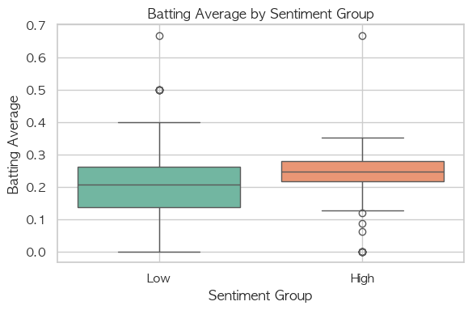
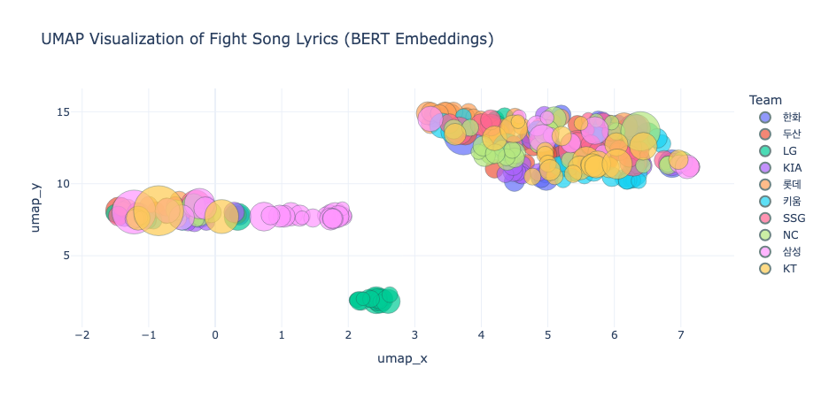

# KBO Fight Song Sentiment: Do Cheering-Song Lyrics Relate to Hitters' Performance?

A course project (KAIST HSS510, NLP for Humanities and Social Sciences, Spring 2025). It tests whether the emotional intensity of a batter's fight song (응원가) lyrics is associated with how he hits, using three KBO seasons (2022 to 2024).


*Hitters whose fight songs score higher on sentiment have higher batting averages.*

**In short**
- 54,000+ batter-game records (2022 to 2024) joined to hand-coded fight song lyrics.
- Higher lyric sentiment goes with higher batting average (r = 0.249, p < .001), but it explains only 6.2% of the variance, and it is an association, not a cause.
- No evidence that the effect is stronger at home games or in bigger crowds.

## Problem
Fight songs are played while a batter stands at the plate, and each batter has his own. Research on cheering culture is mostly sociological, and research on crowds and performance looks at attendance or home advantage. I wanted to treat the lyrics as a measurable variable and ask whether more emotional lyrics go with better batting.

## My role
I designed the question and the seven hypotheses, collected the data, hand-collected and coded the fight song lyrics (including whether a song is reused or inherited), built the sentiment dictionary, ran the statistics, and wrote the paper. I used Claude Code as a coding assistant.

## Data
- Game schedules, attendance and results for 2022 to 2024, scraped from the KBO website with Selenium and BeautifulSoup. More than 54,000 batter-game records, one per player per game, after removing rain-cancelled games.
- Hitter box-score stats (at-bats, hits, RBIs, runs, batting average, batting order, position) pulled from the KBO game data using each game ID.
- Fight song lyrics, titles and singers, collected by hand for the batters who appeared. Not published here, because the lyrics belong to their rights holders.

This repository includes only small summary tables (`data/`). Rebuild the rest by running the scraping cells of the notebook.

## Tools
Python: Selenium, BeautifulSoup, pandas, Kiwi (Korean morphology), KoBERT and sentence-transformers, scikit-learn (K-means, PCA), UMAP, statsmodels (OLS, mixed-effects), scipy, SHAP, matplotlib, seaborn.

## Process
1. Scrape schedules, attendance and results, then each game's hitter stats.
2. Code each batter's song: lyrics, reused (same melody, new lyrics) or inherited (same lyrics, new name), and how many batters share it.
3. Score sentiment with a custom baseball dictionary (team names 1 point, performance words such as 홈런 and 안타 2 points) and a boost for chant patterns: lyrics in parentheses or near exclamation marks, and repeated vowels such as 워어어.
4. Embed team-level lyrics with KoBERT, cluster with K-means, and view with PCA and UMAP.
5. Test hypotheses with correlation, OLS with robust standard errors, t-tests, ANOVA and mixed-effects models.

The notebook is `notebooks/KBO_statistics.ipynb`.

## Key insights
- Sentiment score and batting average are positively correlated (Pearson r = 0.249, Spearman rho = 0.305, both p < .001). In a simple regression, a one-standard-deviation higher score goes with about +0.025 batting average, and it explains 6.2% of the variance. The effect stays at +0.024 after controlling for crowd size and home-game ratio.
- No evidence that the effect is stronger at home games (interaction p = 0.403).
- Crowd size: the lyric effect stays, and low-attendance games have lower averages (beta = -0.022, p = 0.021), but the sentiment-by-crowd interaction is not significant (p = 0.998).
- Shared songs (reused or inherited) show no difference in batting performance.
- Team lyric styles cluster: Hanwha, NC, Doosan and SSG look alike, KIA and Samsung share expressions, and KT sounds the most distinct.



## Business impact
This is a course project with no deployment. The practical takeaway is a method for turning short, informal text (chants) into a numeric feature and testing it against outcome data, which transfers to other text-versus-metrics questions such as ad copy and conversion.

## Challenges and learnings
- Default Korean sentiment tools treat chants like 워어어 as noise, so I built a custom dictionary with chant-pattern boosts. It is my own and small, and I have not checked it against human ratings.
- The result is an association, not a cause. R-squared is 6.2%, and the data cannot separate "better hitters get more energetic songs" from "energetic songs help hitters".
- Hand-coding which songs are reused or inherited was slow, and the coding rules are written up in my course paper (not published here).
- TODO (Kelly): add one more lesson from the scraping or modeling work.

## Run it
```bash
pip install -r requirements.txt
jupyter lab notebooks/KBO_statistics.ipynb
```
The scraping cells need Chrome and chromedriver. Check the KBO website's terms before scraping, and keep the request rate low.

## License
MIT. See `LICENSE`.
